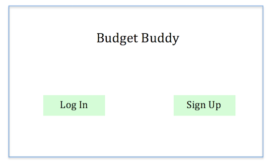
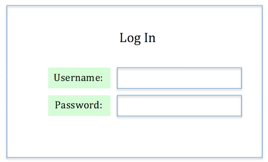
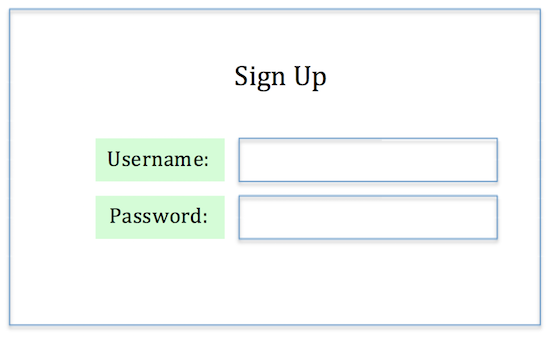
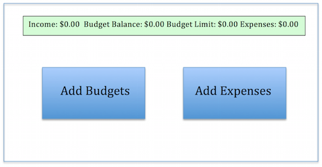
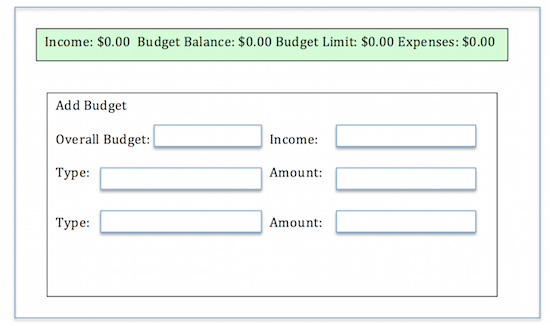
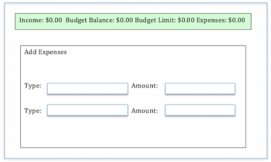
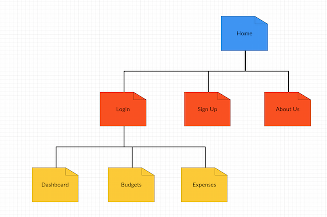

# Budget Buddy

## Overview

Staying on budget while in college is quite tricky. This is where "Budget Buddy" comes to the rescue! Budget Buddy is a web app that allows users to keep track of their expenses and plan their savings. Users can register and login. Once they're logged in, they can add their monthly income, monthly overall budget, and as many individual budget categories (such as Rent, Food, Miscellaneous, etc.). After setting their monthly budget plan, users can then add their expenses by expense type. There will be two pages: one for the budget and one for expenses. The budget page will list the different budget categories. The expense page will list the different expenses inputted by the user. The user will be able to filter through these expenses by expense category or date. Displayed across the top of every page will be the user's monthly Income, Budget Balance (how much available left to spend for the month), Budget Limit (how much the user set at their monthly overall budget), and Expenses (total expenses for the month that the user has inputted). 


## Data Model

First draft schema:

```javascript
// users
// * our site requires authentication...
// * so users have a username and password
// * they also have a budget list and an expense list 
var User = new mongoose.Schema({
  // username, password provided by plugin
  budgetList:  [{ type: mongoose.Schema.Types.ObjectId, ref: 'List' }],
  expenseList:  [{ type: mongoose.Schema.Types.ObjectId, ref: 'List' }],
});


// an item (or group of the same items) in a budget list
// * includes the type of the budget (overall, food, rent, etc.)
// * includes the amount entered for that budget
var Budget = new mongoose.Schema({
  type: {type: String, required: true},
  amount: {type: Number, min: 1, required: true}
});

// an item (or group of the same items) in a budget list
// * includes the type of the budget (overall, food, rent, etc.)
// * includes the amount entered for that budget
var Expense = new mongoose.Schema({
  type: {type: String, required: true},
  amount: {type: Number, min: 1, required: true}
});


// a budget list
// * each list must have a related user
// * a list can have 0 or more items
var BudgetList = new mongoose.Schema({
  user: {type: mongoose.Schema.Types.ObjectId, ref:'User'},
  name: {type: String, required: true},
  createdAt: {type: Date, required: true},
  budgets: [Budget]
});


// an expense list
// * each list must have a related user
// * a list can have 0 or more items
var ExpenseList = new mongoose.Schema({
  user: {type: mongoose.Schema.Types.ObjectId, ref:'User'},
  name: {type: String, required: true},
  createdAt: {type: Date, required: true},
  expenses: [Expense]
});
```

## Wireframes

/home - homepage where users can login or sign up for a new account



/home/login - page where users can log in




/home/signup - page where users can create a new account



/dashboard - page that displays the user's budget plan and where the user can choose to add their budget info and expenses 



/budgets - page with a form that lets user's enter their overall budget and budgets for different categories



/expenses - page with a form that lets user's enter their expenses


## Site map




## User stories

1. as a user, I can login or create an account
2. as a user, I can create a new budget plan
3. as a user, I can add expenses
4. as a user, I can view my budget plan
5. as a user, I can view all my expenses

## Research Topics

* (6 points) Integrate user authentication
* (2 points) Bootstrap CSS framework

